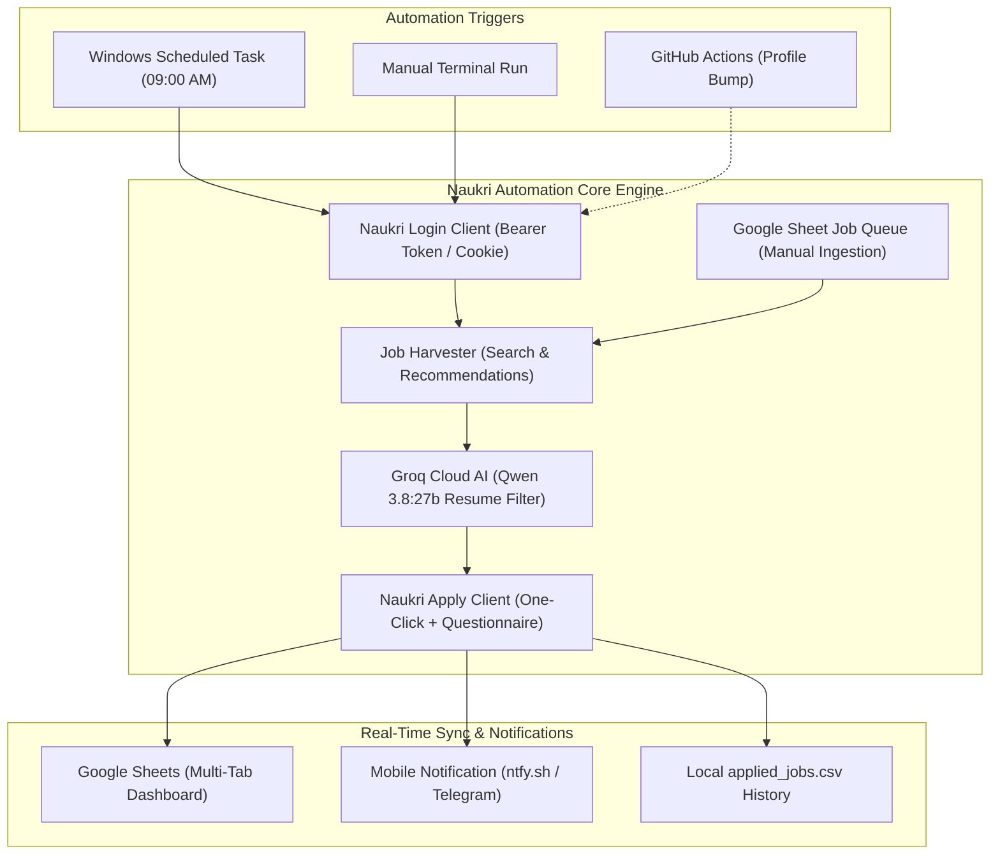

<div align="center">

# 🚀 Naukri Automation Agent
### Autonomous AI-Powered Job Application System for Naukri.com

[](https://www.python.org/)
[](https://groq.com/)
[](https://sheets.new)
[](https://ntfy.sh)
[](https://github.com/features/actions)
[](https://microsoft.com)

<p align="center">
  <b>A zero-Selenium, AI-driven automation engine that scans, filters, and applies to relevant software developer jobs on Naukri, logs them to Google Sheets, and sends push notifications to your phone — completely hands-free.</b>
</p>

---

</div>

## 🌟 Key Highlights

- ⚡ **Pure API Execution**: Lightning-fast job scraping and applications directly through Naukri’s native REST endpoints without heavy browser automation.
- 🧠 **Ultra-Fast Cloud AI Resume Matcher**: Evaluates job descriptions against your resume using Groq Cloud LPUs (`qwen/qwen3.8-27b`) in 0.25s. No heavy local models or GPU required.
- 📊 **Multi-Device Google Sheets Sync**: Real-time logging of applied jobs to your Google Sheet. Supports separate tabs for different laptops or profiles.
- 📥 **Interactive Job Queue**: Paste job links into your Google Sheet from your phone or browser. The agent automatically ingests and applies to them with top priority!
- 📲 **Instant Mobile Push Notifications**: Get notified on your phone via `ntfy.sh` (or Telegram/Discord) the moment applications complete with a detailed summary.
- 🕒 **Silent Background Scheduler**: Windows Task Scheduler integration (`pythonw.exe`) runs silently at 9:00 AM daily, wake-from-sleep catch-up, and works on battery power.
- ☁️ **Cloud Profile Booster**: GitHub Actions workflow automatically refreshes your Naukri profile timestamp daily so recruiters always see you marked **"Active Today"**.

---

## 🏗️ System Architecture



---

## ⚡ Quick Start

### 1. Prerequisites
- **Python 3.10+** ([python.org](https://www.python.org/downloads/)) — Ensure *"Add Python to PATH"* is checked.
- **Git** ([git-scm.com](https://git-scm.com/))
- **Free Groq API Key** ([console.groq.com](https://console.groq.com/keys)) — Takes 10 seconds to generate, no credit card required.

### 2. Installation
```powershell
# Clone the repository
git clone https://github.com/adhi2k/Naukri-automation.git
cd Naukri-automation

# Create and activate virtual environment
python -m venv .venv
.\.venv\Scripts\Activate.ps1

# Install requirements
pip install -r requirements.txt
playwright install chromium
```

### 3. Configure `.env`
Copy `.env.example` to `.env` and fill in your details:
```env
# Naukri Credentials
USERNAME=your_email@gmail.com
PASSWORD=YourPassword

# Application Controls
AUTO_APPLY=true
DAILY_APPLY_LIMIT=20
AI_SCORE_LIMIT=15

# Cloud AI Engine (Groq LPU - Free)
GROQ_API_KEY=gsk_your_groq_api_key_here
GROQ_MODEL=qwen/qwen3.8-27b

# Google Sheets Real-Time Sync & Job Queue
GOOGLE_SHEET_WEBHOOK_URL=https://script.google.com/macros/s/YOUR_SCRIPT_ID/exec
GOOGLE_SHEET_TAB_NAME=Applied_Jobs
GOOGLE_SHEET_QUEUE_TAB=Job_Queue

# Instant Mobile Alerts (Free & Private via ntfy.sh)
NTFY_TOPIC=noperi_your_unique_topic
```

### 4. Run the Agent
```powershell
python apply_agent.py
```

---

## 📋 Comprehensive Feature Guide

### 📱 1. Mobile Push Notifications via `ntfy.sh`
Naukri Automation Agent dispatches a notification to your phone the second applications are finished.

1. Install the free **ntfy** app on [iOS App Store](https://apps.apple.com/app/ntfy/id1625396347) or [Google Play Store](https://play.google.com/store/apps/details?id=io.heckel.ntfy).
2. Open the app, tap **Subscribe to topic**, and enter the name of your topic (e.g., `naukri_adhithya_jobs`).
3. Set `NTFY_TOPIC=naukri_adhithya_jobs` in your `.env`.
4. When Naukri Automation Agent completes, you will receive an alert with:
   - Total jobs applied today
   - Job titles and companies
   - Direct link to your Google Sheet

---

### 📊 2. Google Sheets Dashboard & Multi-Device Setup

Track all applications in real-time without opening any local files.

| Feature | How It Works |
| :--- | :--- |
| **Zero GCP Setup** | Powered by an Apps Script Webhook. No Google Cloud Console or service account keys required. |
| **Multi-Laptop Support** | Set `GOOGLE_SHEET_TAB_NAME=Laptop2_Applied` on your second device. It automatically creates and populates that tab in the exact same sheet. |
| **Automatic Headers** | Newly created tabs are instantly styled with frozen bold headers. |

> Complete setup guide and webhook code: [GOOGLE_SHEET_SETUP.md](GOOGLE_SHEET_SETUP.md).

---

### 📥 3. Google Sheets Job Queue (Apply from Anywhere)

Find an interesting job on LinkedIn or Naukri while on your phone?

1. Open your Google Sheet and navigate to the **`Job_Queue`** tab.
2. Paste the job URL or 12-digit job ID into **Column A**:
   | Column A (Job URL or ID) | Column B (Status) | Column C (Updated At) |
   | :--- | :--- | :--- |
   | `https://www.naukri.com/job-listings-python-dev-123456789012` | `PENDING` | *(empty)* |
   | `010124005678` | `PENDING` | *(empty)* |
3. During the next automated run, Naukri Automation Agent will:
   - Pull all pending jobs from this table.
   - Inject them at the **top priority** of the application batch.
   - Automatically mark **Column B** as `APPLIED` with a timestamp.

---

### 🕒 4. Silent Daily Automation (Windows Task Scheduler)

Never worry about forgetting to run the script. The agent can run as a silent background Windows task.

```powershell
python setup_daily_schedule.py
```

- **Runs Silently**: Uses `pythonw.exe` so no command prompt window pops up while you are working.
- **Laptop Friendly**: Executes on both battery power and AC power (`-AllowStartIfOnBatteries`).
- **Missed Run Catch-Up**: If your laptop is asleep at 09:00 AM, it triggers automatically as soon as you wake or unlock your device.
- **Safety Lock**: Uses `last_run_date.txt` to guarantee it never runs more than once per day.

---

### ☁️ 5. Cloud Profile Timestamp Booster (GitHub Actions)

Naukri’s algorithm promotes profiles that are updated frequently. This repository includes a GitHub Action (`.github/workflows/naukri_profile_bump.yml`) that runs in the cloud every day at 09:00 AM IST.

1. Get your session token:
   ```powershell
   python get_my_token.py
   ```
2. In your GitHub repository:
   - Go to **Settings** > **Secrets and variables** > **Actions**.
   - Create a repository secret named **`NAUKRI_SESSION_TOKEN`** and paste the token.
3. Your profile timestamp will refresh daily in the cloud, keeping you visible to recruiters!

---

### 🔍 6. One-Command System Health Check

Verify all credentials, AI connectivity, and external APIs with a single command:

```powershell
python verify_system.py
```

```text
======================================================================
  Naukri Automation Agent Diagnostics & Pre-Flight Verification
======================================================================
  [PASS] 1. Python Environment & Core Dependencies
  [PASS] 2. Environment Variables (.env)
  [PASS] 2. AI Engine (Groq Cloud LPU: qwen/qwen3.8-27b)
  [PASS] 4. Naukri Credentials & Session Auth
  [PASS] 5. Google Sheets Webhook Sync
  [PASS] 6. Mobile Push Notification (ntfy.sh)
  [PASS] 7. Windows Daily Task Scheduler
======================================================================
  RESULT: ALL 7 SYSTEMS OPERATIONAL!
======================================================================
```

---

## 📂 Project Structure

```
Naukri-automation/
├── apply_agent.py              # Main autonomous agent orchestrator
├── daily_runner.py             # Scheduled wrapper with single-run lock & error recovery
├── setup_daily_schedule.py     # Windows Task Scheduler installer (pythonw.exe)
├── verify_system.py            # Complete end-to-end diagnostics utility
├── bump_profile_cloud.py       # Cloud profile refresher for GitHub Actions
├── get_my_token.py             # Helper to extract active session token
├── GOOGLE_SHEET_SETUP.md       # Google Apps Script webhook code & instructions
├── NEW_LAPTOP_SETUP.md         # 3-minute setup instructions for a second device
├── applied_jobs.csv            # Persistent local log of all applied jobs
├── requirements.txt            # Python dependencies
├── .env                        # Local configuration & credentials
│
└── src/
    ├── client/
    │   ├── naukri_client.py    # Core authentication & profile client
    │   ├── job_client.py       # Search, recommendation, & apply engine
    │   └── jop_classifier.py   # AI scoring pipeline & candidate profile
    ├── models/
    │   └── models.py           # Dataclasses (Job, Application, Session)
    └── utils/
        ├── google_sheets.py    # Webhook & gspread sync + job queue reader
        ├── notifier.py         # ntfy.sh, Telegram, & Discord notification dispatcher
        └── profile_updater.py  # Profile headline/summary refresher
```

---

## 🛡️ Safety & Rate Limiting

- **Daily Apply Cap**: Enforces a strict limit (default: 20 applications/day) to prevent account flagging.
- **Smart Delays**: Randomized human-like pauses between searches and submissions.
- **Deduplication**: Multi-layer deduplication ensures you never apply to the same job ID twice across runs.
- **External Apply Handling**: Intentionally bypasses external employer URLs that require third-party logins.

---

## ⚠️ Disclaimer

This tool is designed strictly for personal career automation on your **own** Naukri account. Please use responsibly and adhere to [Naukri's Terms of Service](https://www.naukri.com/termsAndConditions). The authors are not affiliated with Naukri.com or Info Edge India Ltd.

---

<div align="center">
  <sub>Built with ❤️ by Adhithya | Automated career growth for developers</sub>
</div>